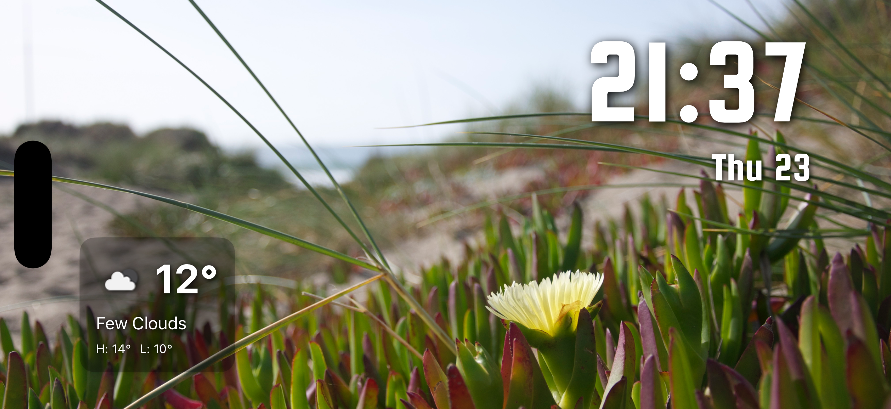
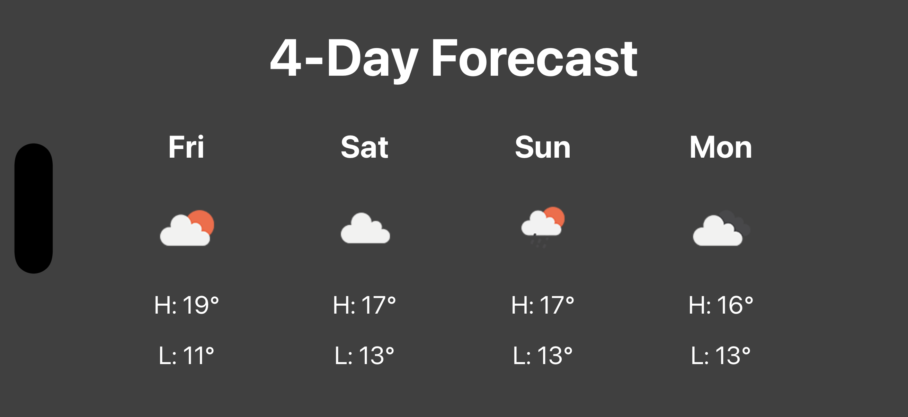

# Standby

This app was originally forked from [https://github.com/SemihK/standby](https://github.com/SemihK/standby), but has been modified for personal use and the fork has been detached.

## Purpose

The purpose of this app is to replace an Amazon Echo display, which has been showing an increasing number of advertisements. Since I have a spare iPhone 11, I decided to create this app to serve as a replacement, running on the iPhone.

## App Description

This app is a personalized digital photo frame that displays photos from your library, the current date and time, and live weather information.

To prevent screen burn-in from static UI elements, the app will display a full-screen 4-day weather forecast at a regular interval (every 60 seconds for 15 seconds). This ensures that the pixels on the screen are changing and helps to preserve the life of the display, while also providing useful information.

## Screenshots




## Setup

To use the weather feature, you will need to add your own OpenWeatherMap API key. You can get a free API key by signing up on the [OpenWeatherMap website](https://openweathermap.org/appid).

Once you have your API key, you will need to add it to the following file:

`StandByTime/standbytime/Model/OpenWeatherService.swift`

Open this file and replace the placeholder text with your API key:

```swift
private let apiKey = "YOUR_API_KEY" // TODO: Replace with your OpenWeatherMap API key
```